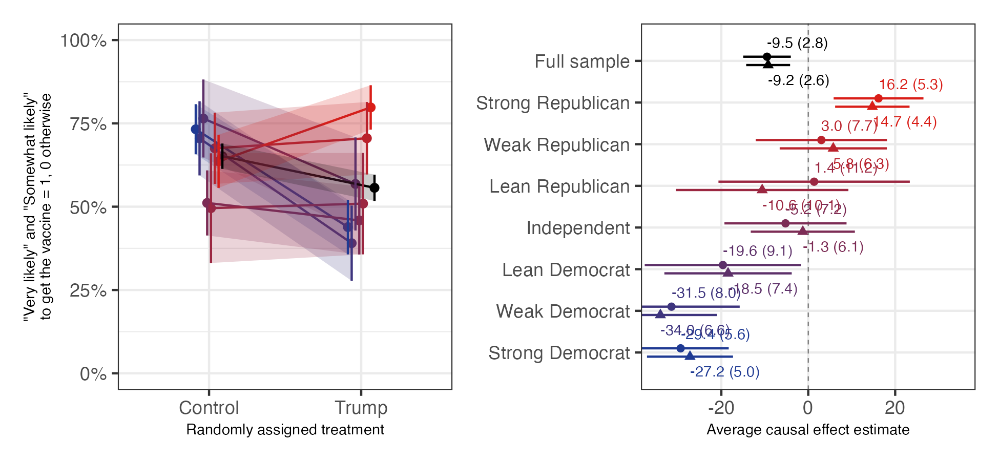
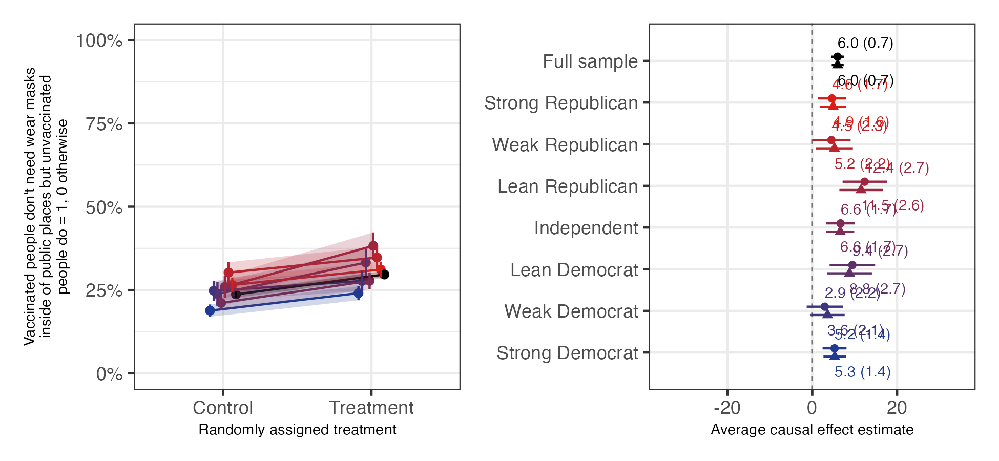
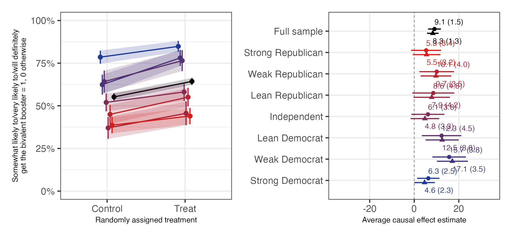
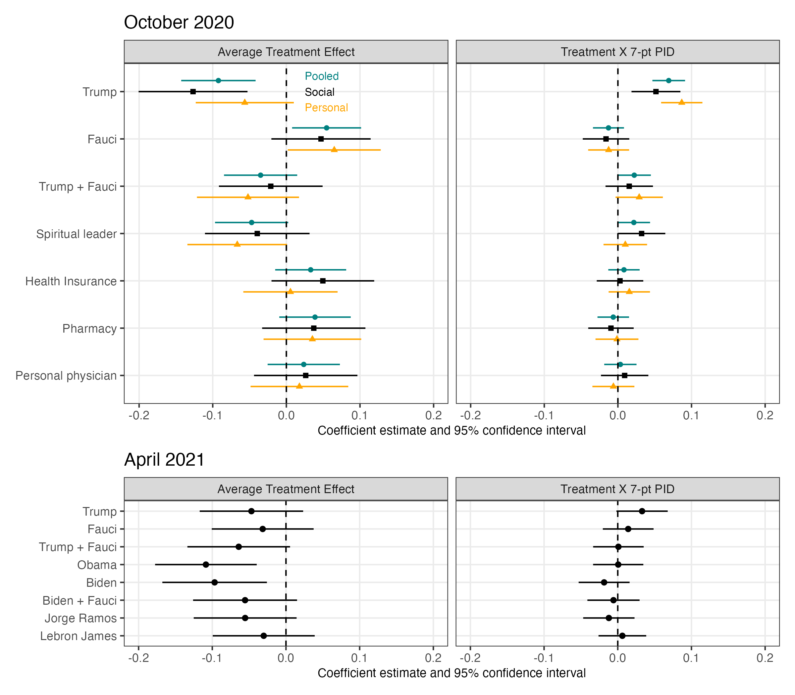
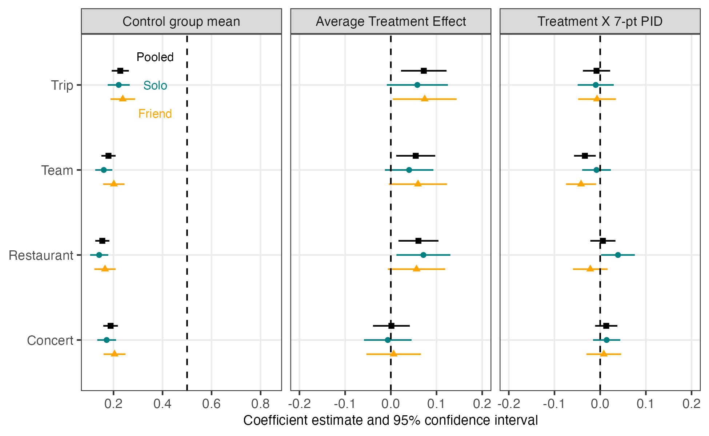

# Reproducibility Report: Baxter-King, Coppock, Straus and Vavreck (2025)


- [Paper Overview](#paper-overview)
- [Summary](#summary)
  - [Does the deposited archive run?](#does-the-deposited-archive-run)
  - [Does the maintained rewrite reproduce the
    paper?](#does-the-maintained-rewrite-reproduce-the-paper)
- [Original Archive Reproducibility](#original-archive-reproducibility)
  - [What runs, and what a stripped copy
    shows](#what-runs-and-what-a-stripped-copy-shows)
  - [The two scripts that fail](#the-two-scripts-that-fail)
  - [Checksums](#checksums)
- [Errata](#errata)
- [Ground Truth Verification](#ground-truth-verification)
  - [Where the rewrite differs from the
    article](#where-the-rewrite-differs-from-the-article)
  - [Coverage of the published
    floats](#coverage-of-the-published-floats)
  - [Every number in the article,
    extracted](#every-number-in-the-article-extracted)
- [Maintained Rewrite](#maintained-rewrite)
- [Figure Verification](#figure-verification)
- [Maintained Rewrite Verification](#maintained-rewrite-verification)
- [R Environment](#r-environment)

*Drafted by Claude Opus 5 under the supervision of Alex Coppock.*

This repository holds the actively maintained replication code for
Baxter-King, Coppock, Straus and Vavreck (2025), together with the
reproducibility report that documents what the original archive did and
did not do. It is part of a program applying the maintenance proposal in
Peer, Orr and Coppock (2021, *PS: Political Science & Politics*, doi
[10.1017/S1049096521000366](https://doi.org/10.1017/S1049096521000366))
to a set of published archives.

|  |  |
|----|----|
| Article | [10.1093/pnasnexus/pgaf185](https://doi.org/10.1093/pnasnexus/pgaf185) |
| Replication archive | [osf.io/bwv3c](https://osf.io/bwv3c/) |
| Pre-analysis plans | None; the article states the analyses were not preregistered |

**The data are not redistributed here.** The deposit lives on OSF and
that is the only copy this repository points at. `download_original.R`
fetches it and verifies every file; `original_manifest.csv` records the
OSF file identifier, byte size, MD5 and SHA-256 of each of the 101
deposited files. OSF publishes two hashes of one set of stored bytes,
computed by two different algorithms, so both are genuine checks and the
script gates on both plus byte size. It also stops if `original/` holds
anything the manifest does not list, and stops if a file that is already
present no longer matches, which is how a mid-run write into the deposit
would be caught rather than silently repaired. Re-hosting a copy would
create a second archive that can drift from the first, which is the
problem this project exists to document rather than to add to.

**Repository layout.** `maintained/` is the maintained rewrite: one
script per published table or figure, writing to `output/`, which is
committed so a reader can compare a fresh run against it without
downloading anything. `ground_truth/` ties every published number to the
code that produces it, and `maintained/in_text_claims.R` prints the same
numbers again by an independent route. `original/` is created by the
download script and is deliberately absent from the repository. This
README is the reproducibility report, also available as a PDF in
`report/`.

**License.** CC0 1.0 Universal, matching the terms of the deposit this
repository maintains, so nothing in the chain is more restrictive than
the archive itself. See `LICENSE`.

**To reproduce.** Clone or download the repository, open
`baxter-king_etal_2025.Rproj`, and run:

``` r
source("run_all.R")
```

That fetches the deposited archive from OSF, verifies its checksums,
fits every model, writes every table and figure into
`maintained/output/`, runs the deposited code twice in a throwaway copy,
rebuilds the ground truth, prints the in-text claims, and re-verifies
the deposit. It takes about ten minutes. Individual scripts can be run
on their own, but the three `analysis_*.R` scripts come before the
tables and figures that read their model objects.

Required packages: tidyverse, estimatr, patchwork, modelsummary, knitr,
kableExtra, scales, openssl, lmtest, here. Paths resolve through `here`,
so nothing depends on the working directory. A successful run overwrites
`maintained/output/`, which is committed: **`git diff` on that folder is
the reproduction check**, and the CSV, TeX, PNG and RDS output should
come back byte-identical. The five PDF figures always show as changed,
because a PDF records the time it was written; compare their PNG twins
instead.

## Paper Overview

**Citation**: Baxter-King, R., Coppock, A., Straus, G. and Vavreck, L.
(2025). Endorsements vs. information: experimental evidence of backlash
and parallel persuasion during the COVID-19 public health crisis. *PNAS
Nexus*, 4(6), pgaf185.

**Research question**: Which of three kinds of persuasive appeal,
endorsements, guidance and mandates, and factual information, move
intentions to vaccinate and attitudes to masking, and do their effects
differ by party?

**Design**: Ten survey experiments fielded in the UCLA COVID-19 Health
and Politics Project between October 2020 and October 2022, among a
total the article reports as 85,191 respondents. Two endorsement
experiments randomize the identity of the person endorsing a vaccine;
three guidance experiments randomize whether respondents are told the
CDC recommends a masking policy or that vaccination is required for an
activity; five information experiments randomize factual information
about contagiousness and booster effectiveness. All estimates are
weighted, use the Lin covariate adjustment, and take HC1 robust standard
errors. Effects are reported overall and conditional on seven-point
party identification.

**Main finding**: Endorsements by political figures polarize. Trump’s
endorsement lowered intentions to vaccinate by 9.2 points on average in
October 2020 while raising them among strong Republicans, and by April
2021 endorsements by Biden and Obama lowered intentions among the still
unvaccinated in both parties. Guidance and information move Democrats
and Republicans in parallel: telling respondents the CDC recommended a
masking policy raised support for it by 6 points with no partisan
interaction, and information about the bivalent booster raised booster
intentions by 8.3 points, again without partisan heterogeneity.

------------------------------------------------------------------------

## Summary

The ground truth carries 506 rows. Where the deposited code produces a
number the article prints, it reproduces it: 445 such comparisons agree
at the precision the page prints and 7 do not. The maintained rewrite
agrees with the article on 475 values and disagrees on 25, and 6 rows
are unverifiable because the article states no number.

### Does the deposited archive run?

The deposit ships 101 files of code, data and metadata and no output
directory. Run in order, 61 of its 63 scripts complete and 2 fail. Every
write in the deposit goes to a directory the deposit does not ship, so a
full run overwrites 0 of the 101 deposited files. Running the archive in
place would therefore be safe here, which is not something a reader
could know without measuring it.

### Does the maintained rewrite reproduce the paper?

Yes, with two classes of exception. Every coefficient, standard error,
sample size and R-squared in Tables 2 and 3 and in appendix Tables S1 to
S4 reproduces, as does every estimate and standard error printed on
Figures 1, 3 and 5, and every number the article states in prose or in a
footnote. Of the 704 numbers printed on the section C appendix figures,
663 reproduce and 41 do not.

The first class is the sample sizes of Table 1, which count respondents
enrolled in each experiment while the deposited analysis files hold
fewer rows, together with one appendix claim that turns on a coding
error in the deposit. The second is new and is a choice this rewrite
makes rather than a defect in the article. `lm_lin()` reports the effect
at the covariate means, and that quantity exists only while every
covariate is interacted with the treatment. In 21 of the 154 conditional
cells behind the section C panels, on 11 of the 22 figures, one race
category is empty in one of the two arms, which makes the centred race
covariate, its treatment interaction, the intercept and the treatment
indicator four exactly collinear columns. The fit is the same whichever
of the four is dropped and the treatment coefficient is not, so the
published number in those cells records which column the decomposition
aliased rather than an effect, and no version of any software identifies
the quantity there. The rewrite removes the race covariate from those
cells and from no others, which restores the estimand where it was
missing and leaves the other 133 cells at the covariate list the article
used. The `covariates_trimmed` column of
`ground_truth/section_c_cells.csv` names the covariate wherever one was
removed.

------------------------------------------------------------------------

## Original Archive Reproducibility

### What runs, and what a stripped copy shows

The deposit is run twice in a throwaway copy, never in place. The first
pass runs its scripts in the order `code/main.R` sources them and lets
each see what the ones before it wrote. The second runs each script
against a copy holding only deposited files, which is the test of
whether a script passes only because another script left something
behind.

| Pass       | Errors | Ran clean |
|:-----------|-------:|----------:|
| as_shipped |      2 |        61 |
| stripped   |     15 |        48 |

Deposited scripts, as shipped and against a copy holding only deposited
files

13 scripts run in the first pass and fail in the second. All of them
read a model object an earlier script wrote, which is the deposit
working as intended rather than a defect: `code/main.R` sources the
analysis scripts before the tables and figures. It does mean that no
table or figure script in this deposit can be checked on its own.

### The two scripts that fail

| Script | Error |
|:---|:---|
| code/figures/figure_mini_meta.R | Error in eval(ei, envir) : object ‘four_colors’ not found |
| code/figures/appendix_figures_D24_D45.R | Error in `method(update_ggplot, list(class_any, ggplot2::ggplot))`: |

Deposited scripts that fail when the deposit is run in order

`code/figures/figure_mini_meta.R`, which draws appendix Figure S62,
never sources `code/helpers.R` and so cannot find the colour palette it
uses. `code/figures/appendix_figures_D24_D45.R`, which draws appendix
Figures S24 to S45, composes plots with `+` without loading `patchwork`;
under ggplot2 4.x that is an error rather than the silent success it
once was. Both are one-line fixes, and both mean that appendix figures
the article cites cannot be redrawn from the deposit as it stands.

`code/figures/appendix_figures_E48_E59.R` is a third script worth
naming: it exists in the deposit, the deposit’s own README describes it,
and `code/main.R` never sources it.

### Checksums

All 101 deposited files match the MD5, the SHA-256 and the byte size
that OSF publishes for them, and `original/` holds nothing else. The
manifest records those published values, so a reader can verify a fresh
download against the same numbers; the report does not quote a post-run
hash of any file this pipeline writes, because a PDF records the time it
was written and its hash changes on every run.

------------------------------------------------------------------------

## Errata

The maintained rewrite corrects one coding error in the deposit. It
changes a claim the article makes.

**The standard error of a difference in conditional average treatment
effects.** The deposit’s `dic_estimator()` in `code/helpers.R` computes

``` r
std.error = sqrt(std.error_2 ^2 + std.error_2^2)
```

The second term should be `std.error_1`. As written, the Republican
standard error is squared twice and the Democratic one never enters, so
every standard error, p-value, confidence interval and equivalence-test
p-value in the appendix’s equivalence tables is computed from the wrong
quantity. This is a typographical error rather than an analytical
choice, so the rewrite uses `sqrt(std.error_1^2 + std.error_2^2)`.

The correction moves a published claim. The article says that among the
four vaccine mandate vignettes “we can affirm equivalence at 10 points
in two cases but cannot in two cases.” Under the deposit’s standard
error 2 of the four vignettes affirm equivalence at ten points; under
the corrected one, 1 does. The ground truth records this row as a
mismatch with `defect_locus = archive`.

Two further defects in the deposit are reported rather than corrected,
because correcting them would change the published figures rather than a
computation.

**The series labels of Figure 2 are swapped.**
`code/analysis/run_models_w3_endorse_by_arm.R` fits the models named
`*_prosocial` on the subset `experiment_arm == "A (Personal)"` and the
models named `*_not_prosocial` on `experiment_arm == "B (Social)"`.
`code/figures/figure_2.R` then relabels `Prosocial` as `Social` and
`Not Prosocial` as `Personal`. Each framing’s estimates are therefore
plotted under the other framing’s label. The rewrite labels each series
by the `experiment_arm` value the model was fitted on.

**The rows of the guidance equivalence table are swapped.**
`code/tables/equiv_test_guidance.R` maps the label
`G-1: CDC Mask Guidance 1` to the model object `w7_fit_cdcmask` and
`G-3: CDC Mask Guidance 2` to `w6_fit_cdcmask`. G-1 is the June 2021
experiment, whose analysis file is `w6`, and G-3 is the September 2021
experiment, whose file is `w7`. The two rows of the published table
carry each other’s numbers.

------------------------------------------------------------------------

## Ground Truth Verification

`ground_truth/build_ground_truth.R` runs as the last step of
`run_all.R`. Every published value in it was read from the article or
its appendix and is used only as a comparison target; the archive column
is read from a fresh run of the deposited code and the rewrite column
from `maintained/output/`, so neither can drift from the code that made
it. Published values are carried as the digits the page prints, and a
value agrees when the pipeline’s number, printed to that precision,
gives the same digits.

| Table or figure           | Rows | Archive agrees | Rewrite agrees | Rewrite differs |
|:--------------------------|-----:|---------------:|---------------:|----------------:|
| Appendix Table S2         |   80 |             80 |             80 |               0 |
| Appendix Table S3         |   80 |             64 |             80 |               0 |
| Appendix Table S1         |   70 |             70 |             70 |               0 |
| Table 3                   |   50 |             50 |             50 |               0 |
| Appendix Table S4         |   40 |             32 |             40 |               0 |
| Figure 1                  |   32 |             32 |             32 |               0 |
| Figure 3                  |   32 |             32 |             32 |               0 |
| Figure 5                  |   32 |             32 |             32 |               0 |
| Table 2                   |   20 |             20 |             20 |               0 |
| Results, endorsements     |   14 |              8 |             12 |               1 |
| Table 1                   |   10 |              0 |              0 |              10 |
| Materials and methods     |    7 |              2 |              4 |               2 |
| Results, information      |    5 |              5 |              5 |               0 |
| Results, guidance         |    3 |              2 |              2 |               0 |
| Figure 2                  |    2 |              0 |              0 |               0 |
| Footnote c                |    2 |              0 |              2 |               0 |
| Abstract and Introduction |    1 |              0 |              0 |               1 |
| Appendix Figure S1        |    1 |              1 |              1 |               0 |
| Appendix Figure S10       |    1 |              0 |              0 |               1 |
| Appendix Figure S11       |    1 |              1 |              0 |               1 |
| Appendix Figure S12       |    1 |              0 |              0 |               1 |
| Appendix Figure S13       |    1 |              0 |              0 |               1 |
| Appendix Figure S14       |    1 |              0 |              0 |               1 |
| Appendix Figure S15       |    1 |              0 |              0 |               1 |
| Appendix Figure S16       |    1 |              1 |              1 |               0 |
| Appendix Figure S17       |    1 |              1 |              1 |               0 |
| Appendix Figure S18       |    1 |              1 |              1 |               0 |
| Appendix Figure S19       |    1 |              1 |              1 |               0 |
| Appendix Figure S2        |    1 |              1 |              0 |               1 |
| Appendix Figure S20       |    1 |              1 |              1 |               0 |
| Appendix Figure S21       |    1 |              1 |              0 |               1 |
| Appendix Figure S22       |    1 |              1 |              0 |               1 |
| Appendix Figure S3        |    1 |              1 |              1 |               0 |
| Appendix Figure S4        |    1 |              1 |              1 |               0 |
| Appendix Figure S47       |    1 |              0 |              1 |               0 |
| Appendix Figure S5        |    1 |              1 |              1 |               0 |
| Appendix Figure S6        |    1 |              1 |              1 |               0 |
| Appendix Figure S7        |    1 |              1 |              1 |               0 |
| Appendix Figure S8        |    1 |              0 |              0 |               1 |
| Appendix Figure S9        |    1 |              1 |              0 |               1 |
| Figure 4                  |    1 |              0 |              0 |               0 |
| Footnote f                |    1 |              0 |              1 |               0 |
| Footnote g                |    1 |              0 |              1 |               0 |

Ground truth by location in the article

### Where the rewrite differs from the article

| Claim | Article | Rewrite | Locus |
|:---|:---|---:|:---|
| E-1: Vaccine endorsement 1, N | 14,946 | 14906 | archive |
| E-2: Vaccine endorsement 2, N | 7,249 | 7197 | archive |
| G-1: CDC mask guidance 1, N | 30,857 | 30751 | archive |
| G-2: Vaccine mandate vignettes, N | 10,298 | 10275 | archive |
| G-3: CDC mask guidance 2, N | 33,088 | 32943 | archive |
| I-1: Contagiousness conversation, N | 8,710 | 8661 | archive |
| I-2: Delta variant conversation, N | 8,710 | 8692 | archive |
| I-3: Bivalent booster information, N | 10,700 | 10677 | archive |
| I-4: Bivalent booster information (children), N | 1,628 | 1626 | archive |
| I-5: Holiday surge information (children), N | 1,715 | 1711 | archive |
| Survey respondents across the ten experiments | 85,191 | 96567 | archive |
| E-1: Fauci, printed estimates and standard errors reproduced | 32 | 28 | rewrite |
| E-2: Trump, printed estimates and standard errors reproduced | 32 | 30 | rewrite |
| E-2: Trump and Fauci, printed estimates and standard errors reproduced | 32 | 22 | rewrite |
| E-2: Fauci, printed estimates and standard errors reproduced | 32 | 29 | rewrite |
| E-2: Biden and Fauci, printed estimates and standard errors reproduced | 32 | 28 | rewrite |
| E-2: Biden, printed estimates and standard errors reproduced | 32 | 28 | rewrite |
| E-2: Obama, printed estimates and standard errors reproduced | 32 | 28 | rewrite |
| E-2: James, printed estimates and standard errors reproduced | 32 | 30 | rewrite |
| E-2: Ramos, printed estimates and standard errors reproduced | 32 | 30 | rewrite |
| I-4: Bivalent Booster - Child, printed estimates and standard errors reproduced | 32 | 28 | rewrite |
| I-5: Vaccince - Child, printed estimates and standard errors reproduced | 32 | 30 | rewrite |
| E-2 unvaccinated respondents interviewed | 7,249 | 7197 | archive |
| Mandate vignettes affirming equivalence at 10 points | 2 | 1 | archive |
| Experiments where the interaction term and the difference-in-CATEs disagree | 1 | 2 | paper_internal |

Every row where the maintained rewrite disagrees with the article

10 of these are the N column of Table 1, which reports how many
respondents were enrolled in each experiment. The deposited analysis
file for each experiment holds fewer rows, and the deposit contains no
script that assembles Table 1, so nothing in the archive can produce the
published figures. One more is the headline count of respondents across
the whole project: the union of the respondent identifiers in the ten
deposited analysis files is larger than the 85,191 the abstract reports,
so the deposit does not contain the file from which that number was
counted. Another is the same gap restated in the text for E-2. The
remaining 2 are the equivalence claim discussed above and one appendix
claim about how often the interaction terms and the differences in
conditional average treatment effects agree.

### Coverage of the published floats

The float list is taken from the article and its appendix rather than
from what the pipeline happens to produce: 74 floats in all, of which 35
carry at least one ground-truth row.

| Float group                                | Floats |
|:-------------------------------------------|-------:|
| Appendix section D, predicted unvaccinated |     22 |
| Appendix section D, variable importance    |      1 |
| Appendix section E, vignette CATEs         |     14 |
| Meta-analysis of all studies               |      1 |
| Verified cell by cell                      |     35 |
| Weighted against unweighted                |      1 |

Published floats, by whether the ground truth reaches them

Section C of the appendix is the largest block of published numbers in
the paper and the easiest to overlook. It draws one two-panel figure per
experimental contrast, 22 of them, in the same form as Figures 1, 3 and
5, and each panel prints its estimates and standard errors on the face
of the plot. Those 704 numbers are in no table: the appendix regression
tables carry one treatment by party interaction per contrast, not eight
conditional estimates.
`ground_truth/extract_published_appendix_values.R` parses them out of
the published PDF by position rather than by reading order, and the
parse is checked against Figures 1, 3 and 5, whose values were
transcribed independently from rendered pages. 663 of them reproduce,
and the 41 that do not are the cells whose published specification is
not identified, discussed above.

The 39 uncovered floats are appendix figures, and the largest group is
section D, which repeats the section C panels among respondents a
machine-learning model predicts will remain unvaccinated. Those panels
do print numbers, and nothing here reproduces them: the rewrite does not
refit the prediction model that defines the subgroup, and the deposited
script that draws them fails. Each uncovered float carries its reason in
`ground_truth/float_coverage.csv`, and the build stops if any float has
neither a row nor a reason.

### Every number in the article, extracted

`ground_truth/published_claims.csv` is the extraction of the article’s
prose, its main-text floats and its appendix tables: every numeric token
in them, classified by hand. The 704 numbers printed on the faces of the
section C appendix figures are extracted separately and in bulk, into
`ground_truth/published_appendix_values.csv`, because listing them one
by one here would swamp the file without telling a reader anything the
per-figure rows above do not.

| Claim type   | Claims |
|:-------------|-------:|
| pipeline     |    476 |
| structural   |     12 |
| descriptive  |      8 |
| transcribed  |      6 |
| definitional |      3 |

Numeric claims in the article and appendix, by type

A `pipeline` or `descriptive` claim must have a row in the ground truth
and a block in `maintained/in_text_claims.R`; the build stops if either
is missing. `definitional`, `structural` and `transcribed` claims have
no pipeline counterpart by construction: a scale endpoint is checked
against the survey instrument, a count of experimental groups against
the pipeline object with one row per group, and a number the article
takes from another source against that source.

`maintained/in_text_claims.R` prints every one of these numbers beside
the article’s own sentence, reaching each by its own route from the same
committed output the ground truth reads. Two independent derivations
that disagree have found something.

------------------------------------------------------------------------

## Maintained Rewrite

The rewrite replaces 63 deposited scripts with 21 files. The deposit
fits each model in its own script and repeats the same forty-line block
for every endorser; the rewrite fits all of them by mapping one function
over a named list of arms, so a change to the specification happens in
one place.

| Original | Replacement |
|----|----|
| `rm(list = ls())` | omitted |
| `setwd()` | `here::here()` with `.here` at the repository root |
| `library()` in each script | `source(here::here("maintained", "helpers.R"))` |
| `coefplot::position_dodgev()` | `position_dodge()` on the discrete y axis |
| `saveRDS()` repeated once per model | `map()` over the arms, then `walk2()` |
| Model objects saved with their environment attached | environment dropped, so two runs write identical bytes |
| `readRDS()` / `saveRDS()` | `read_rds()` / `write_rds()` |
| `%>%` | `\|>` |
| Tidy summaries saved where the table needs a fitted object | fitted objects saved throughout |

Two substitutions are worth naming. `coefplot` has not been updated
since 2018 and its `position_dodgev()` is built on ggplot2 3.x internals
that emit a warning for every facet under ggplot2 4.x;
`position_dodge()` handles a discrete y axis natively and the panels are
equivalent. And the deposit saved the mandate vignette models as tidy
tables of coefficients, which is why the deposit records no sample size
or R-squared for appendix Tables S3 and S4; the rewrite saves the fitted
objects, so those cells have a counterpart.

The rewrite also adds four table scripts the deposit lacks or leaves
incomplete: appendix Tables S1 to S4, one script each, each writing its
cells unrounded to a CSV alongside the formatted LaTeX. Nothing
downstream has to read a value back out of a formatted table and round
it twice. It adds one more script for the section C appendix figures,
which write their estimates to a CSV rather than being redrawn.

One substitution in the rewrite is worth stating because it is invisible
in the deposit’s own output. `data_w5_endorse.rds` stores its treatment
variable as a factor whose first level is Obama rather than Control, so
any contrast taken from that file with the factor as shipped is
estimated the other way round: every estimate comes back with the sign
reversed while its standard error looks entirely normal. The rewrite
sets the control group as the reference before estimating anything,
which is a no-op in the other nine analysis files and is what makes the
E-2 appendix panels come out with the signs the article prints.

------------------------------------------------------------------------

## Figure Verification

Figures 1, 3 and 5 print every estimate and standard error on the panel,
in percentage points. All 96 of those numbers reproduce, as do 663 of
the 704 printed on the 22 appendix figures that draw the same panels for
the other contrasts.







Figures 2 and 4 print no numbers. Each figure script writes a CSV of
every estimate it plots, so the comparison is against the appendix
regression tables that print the same coefficients rather than against
the panel.





------------------------------------------------------------------------

## Maintained Rewrite Verification

Nothing in this pipeline draws at random. There is no seed anywhere in
the rewrite because there is nothing to seed: every estimate is a
weighted least squares fit and every test is analytic. Running
`run_all.R` twice from a clean session returns byte-identical CSV, TeX,
PNG and RDS output; only the five figure PDFs differ, because a PDF
records the time it was written.

The acceptance test for a full run is that
`git status --porcelain maintained/output/` shows only those five PDFs.

------------------------------------------------------------------------

## R Environment

| Component    | Version    |
|:-------------|:-----------|
| R            | 4.6.0      |
| tidyverse    | 2.0.0      |
| estimatr     | 2.0.0.9000 |
| modelsummary | 2.6.0      |
| ggplot2      | 4.0.3      |
| patchwork    | 1.3.2      |
| kableExtra   | 1.4.0      |
| here         | 1.0.2      |

Package versions this report was built under
